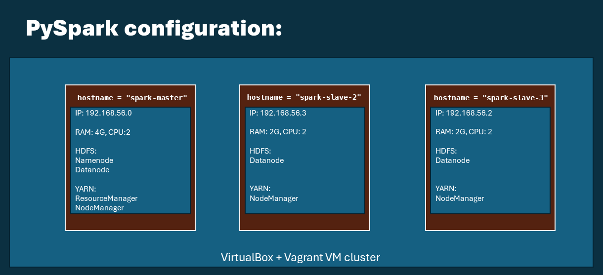

# Activity Pattern Detection using Gas Sensor Array in PySpark Cluster Mode
by Alessandro D'Amico, Riccardo Murgia

This repository contains the **PySpark [UNOFFICIAL] implementation** of the study "Home monitoring for older singles: A gas sensor array system" by Marín, D., Llano, J., Haddi, Z., Perera, A. & Fonollosa, J.
- [Link to the paper](https://upcommons.upc.edu/bitstream/handle/2117/388879/1-s2.0-S0925400523007517-main.pdf;jsessionid=D5C9CCE9EA08B8E09C05EDFB9492A48E?sequence=5)
- [Link to the dataset](https://archive.ics.uci.edu/dataset/799/single+elder+home+monitoring+gas+and+position)

## Run configuration
1. **Jupyter Notebook** : `single-elders-home-monitoring
/single-elders-monitoring-PCAfiltering.ipynb`this implementation is designed to run locally, just to show how the pipeline described by the paper was reproduced.
The python script is meant to run (also) on a VM cluster in PySpark cluster mode, enabling efficient data processing and analysis at scale.
2. **Python Script**: the project includes a Python script of the papers pipeline re-implementation, `single-elders-home-monitoring
/event-recognition-pipeline.py` ,and a PySpark cluster setting that uses Vagrant and VirtualBox to set-up a VMs cluster in **Spark Cluster Mode** as production environment.
The details and the instructions on how to use the cluster configuration are in the `instructions.md` file of this repository.

## Overview
The project aims to identify and analyze significant events and activity patterns in a home environment using data from gas sensors. The primary objectives include:
- Correcting environmental factors and representing the data in PCA space.
- Detecting statistically significant events corresponding to human activities.
- Building a map of daily activities and identifying deviations from regular patterns.
- Benchmarking gas sensor data against motion sensor data to validate the system's accuracy.
